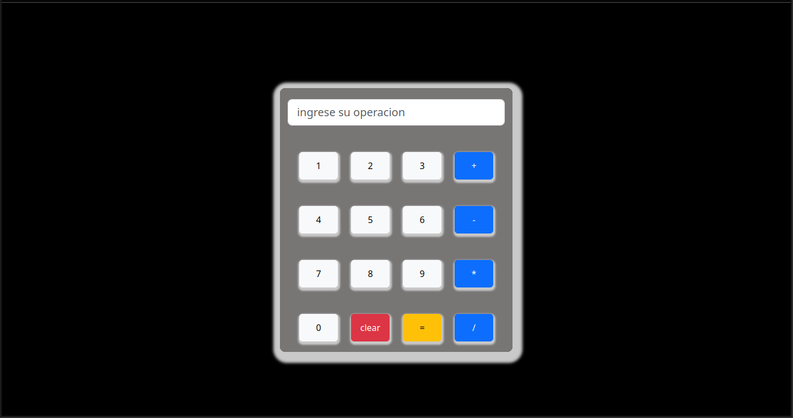
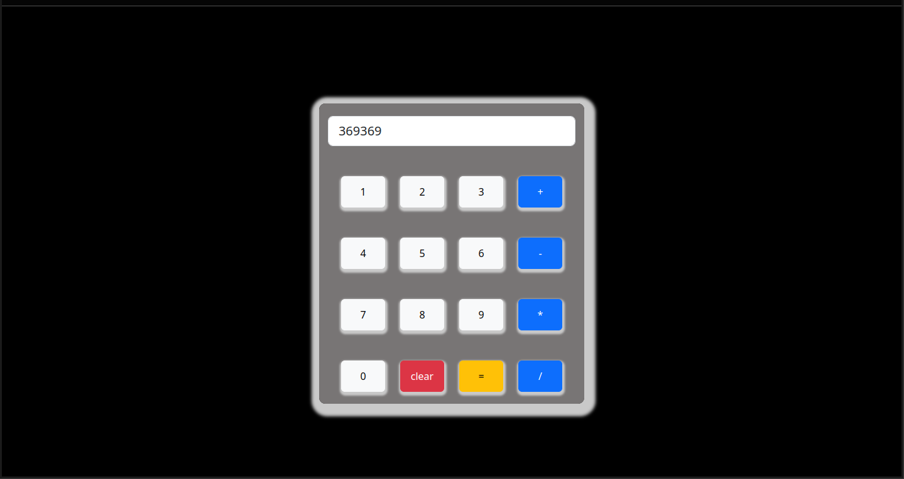

# calculadora con DOM
Este es un proyecto de una calculadora con DOM, usando JavaScript para la logica y CSS para agregarles unos estilos propios. y el uso de un framework que es bootstrap.
Uno de los retos fue la logica detras de la calculadora y los posibles escenarios.

